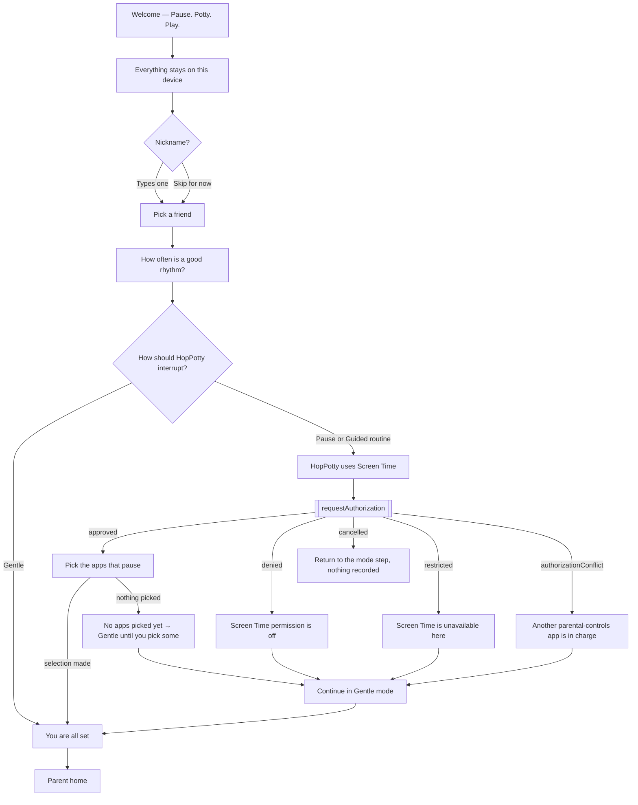
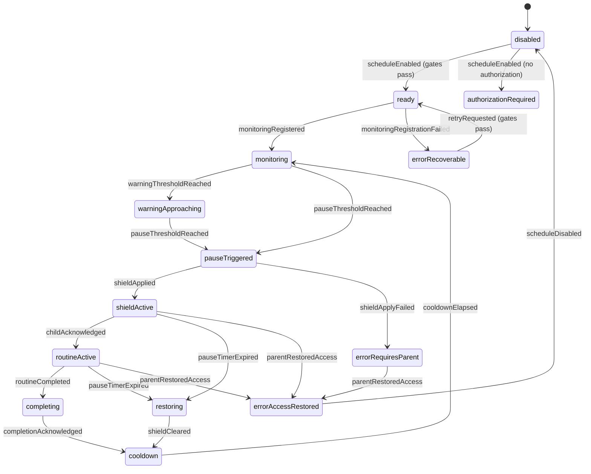
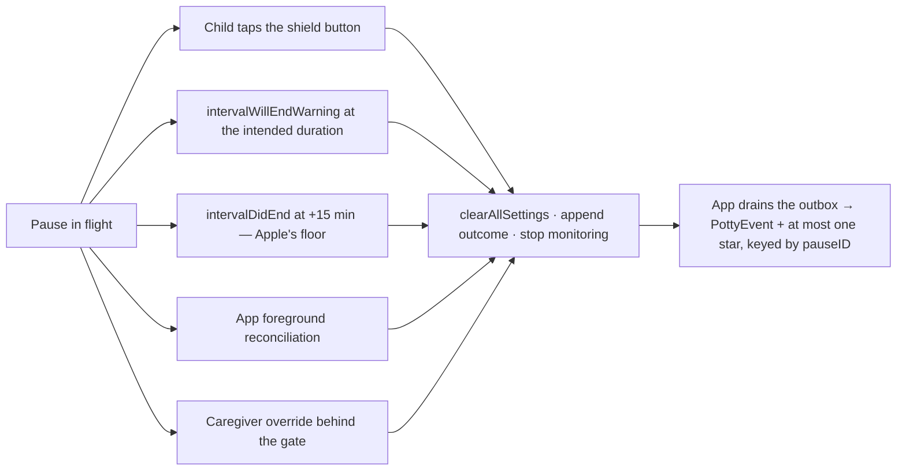
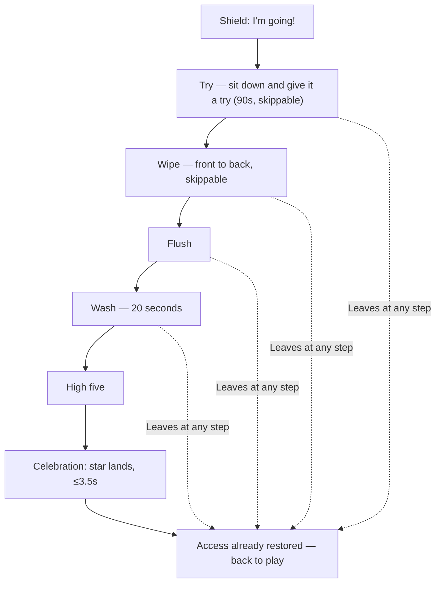
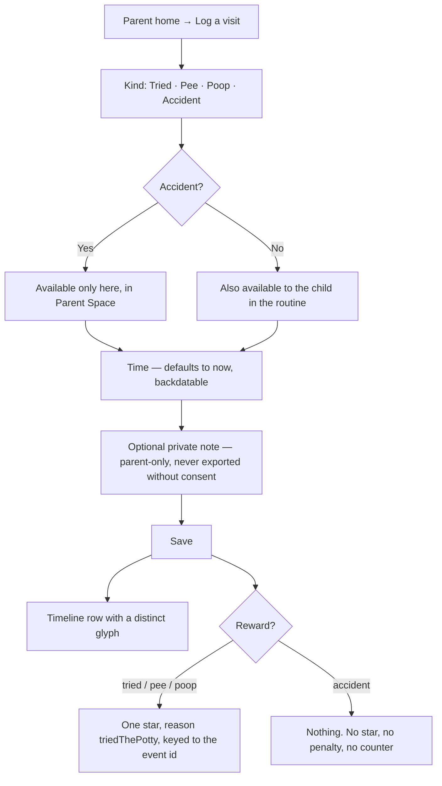
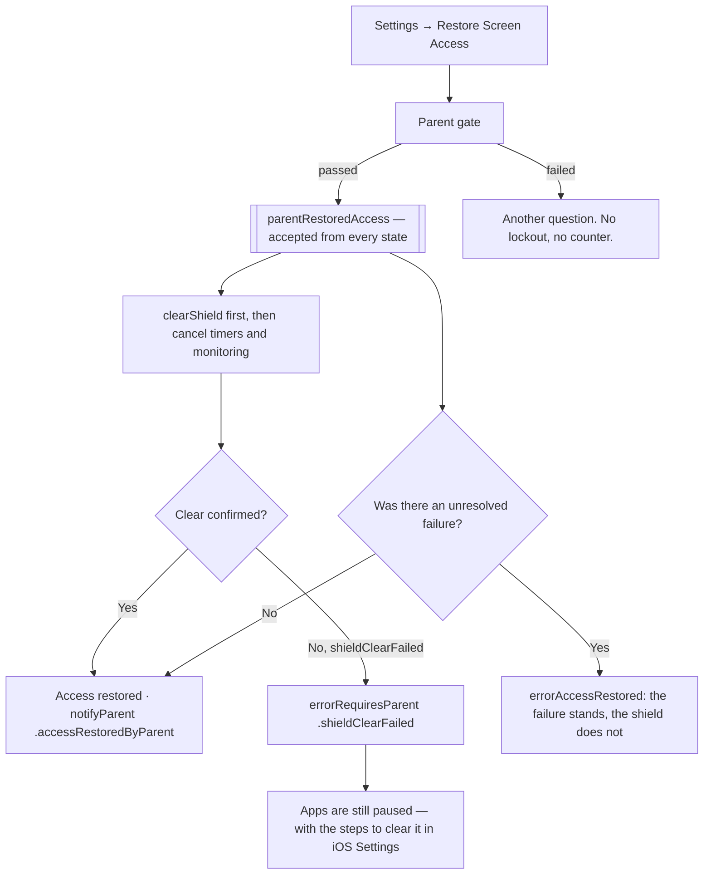
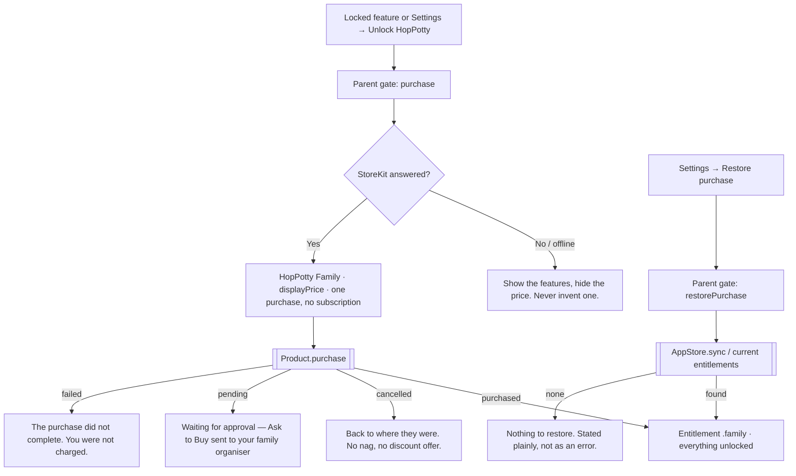
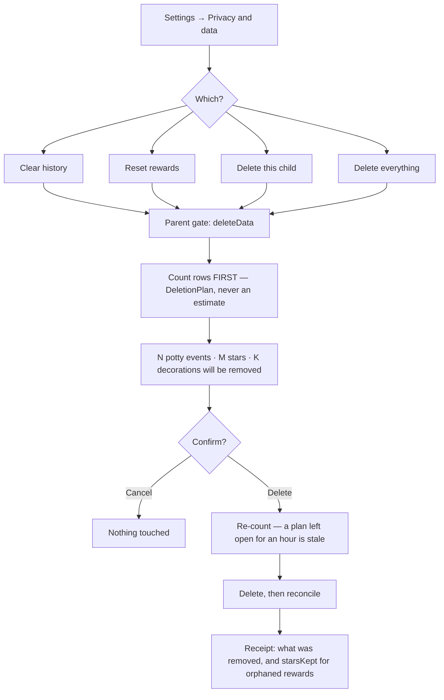

# User Flows

**Date:** 2026-09-01
**Status:** Specification. Every flow below is implemented in domain logic and
tested (`HopPottyCore`) or written and uncompiled (`HopPotty/`). No flow has been
executed on a device.

Denial and error branches are shown alongside the happy path, because in this
product the error branches are the ones that matter: a stranded shield is the
failure that gets a parenting app deleted.

---

## 1. Onboarding

Six steps, all skippable except the first and last. No account, no email, no
network request.

Branch rules:

- **Cancelled is not a failure.** `ScreenTimeAuthorizationOutcome.cancelled` maps
  to `.notDetermined`, not `.denied`, and is never presented as an error.
- **Restricted offers no retry.** `ScreenTimeAuthorizationStatus.isRetryable` is
  false, so the UI must not show a button that cannot work.
- **Gentle is a real destination, not a consolation.** Reminders, the routine,
  stars and the pond all work with no Screen Time authorization at all.

---

## 2. A full Potty Pause lifecycle

The state machine is `HopPottyCore/StateMachine/PottyPauseMachine.swift` — a
pure, total reducer returning effects. Effects are ordered, and `.clearShield` is
always first in any bundle that contains it.

### 2.1 The happy path, in order

| # | Event | State after | Effects (ordered) |
| --- | --- | --- | --- |
| 1 | `scheduleEnabled` | `ready` | clearShield, registerMonitoring |
| 2 | `monitoringRegistered` | `monitoring` | scheduleWarningNotification |
| 3 | `warningThresholdReached` | `warningApproaching` | presentWarning |
| 4 | `pauseThresholdReached` | `pauseTriggered` | applyShield, startPauseTimer, persistSession |
| 5 | `shieldApplied` | `shieldActive` | presentPauseScreen |
| 6 | `childAcknowledged` | `routineActive` | awardParticipation(.answeredPottyPause) |
| 7 | `routineCompleted` | `completing` | **clearShield**, logPauseOutcome(.completedRoutine), awardParticipation |
| 8 | `completionAcknowledged` | `cooldown` | dismissPauseScreen, clearPersistedSession, beginCooldown |
| 9 | `cooldownElapsed` | `monitoring` | — |

Access is restored at **step 7**, not step 8. The celebration runs on top of
unshielded apps: holding a shield open for an animation is holding it open for no
reason.

### 2.2 The five ways it ends

No path consults an outcome. No path can extend a pause: `startedAt`,
`plannedEndAt` and `backstopEndAt` are `let` on `SharedPauseRecord` and written
once.

### 2.3 Cold start after process death

`PottyPauseMachine.recoverFromColdStart` — **every branch clears first**,
including the branch where nothing was persisted.

| Finding | Verdict | Star? |
| --- | --- | --- |
| Nothing on disk | `noSessionFound` | no |
| Malformed, or another child's record | `sessionMalformed` | no |
| `startedAt` in the future (clock moved back) | `clockMovedBackwards` | no |
| `expiresAt` already passed | `sessionExpired` | no |
| Genuinely mid-pause | `interruptedMidPause` | no |
| Mid-pause **and** the child had engaged | `interruptedAfterEngagement` | **yes** |

Order of effects: `clearShield` → `cancelPauseTimer` →
`cancelWarningNotification` → `dismissPauseScreen` → tidy-up. If the process dies
again part-way through, it dies with the shield already down.

The mirror-image decision — "only 40 seconds in, put the shield back" — is never
taken. A pause interrupted by a crash is over.

---

## 3. The child routine

Five steps (`PottyRoutineContent`), fitting inside the default 180-second pause
with room to spare.

Rules:

- **Leaving is always allowed and never costs anything.** `isSkippable` governs
  whether a "Skip this" control appears, not whether the child may leave.
- The sit timer on step 1 is **off by default** — a visible countdown is
  stressful for some children (`AppSettings.routineSitTimerEnabled`).
- Stars: `triedThePotty` on step 1, `washedHands` on step 4, `completedRoutine`
  at the end. All idempotent, all keyed to the durable session id.
- Every step's illustration carries the instruction, so all of them have
  accessibility labels; illustrations here are never decorative.
- With no voice assets bundled, every line is caption-only. That is the normal
  path, not an error state (`HopVoiceAssetState.planned`).

---

## 4. Logging an accident

Parent-recorded only. The child is never asked to self-report one.

- `PottyEventKind.isChildLoggable` is false for `.accident` and gates the child
  UI. `RewardService.reason(for: .accident)` returns `nil`, so the reward path is
  unreachable from an accident even by mistake.
- Timestamp is *when it happened*, not when it was recorded — a parent logging
  twenty minutes late can backdate.
- Insight copy never uses the phrase "accident rate"; it is on the forbidden list.

---

## 5. Emergency restore

The path a caregiver takes when something is wrong and they do not care why.

`errorAccessRestored(failure)` exists because "something is broken" and "a shield
may be standing" are separate facts, and the emergency exit resolves only the
second. It was added when the fail-safe suite caught the restore path
re-accepting whichever error state it was in — see `TechnicalArchitecture.md` §6.

---

## 6. Purchase

Free tier keeps one child, the full routine and every reminder. Nothing a child
earned is ever behind the purchase.

---

## 7. Data deletion

Four operations, each with its own receipt (`DeletionOperation`).

Per-operation behaviour:

| Operation | Removes | Keeps | Star effect |
| --- | --- | --- | --- |
| **Clear history** | Potty events | Child, stars, pond, schedule | Stars from deleted events are **unlinked, never removed**. The receipt names the count kept. |
| **Reset rewards** | Ledger + pond for one child | Child, events, schedule | The only operation that removes a star — data deletion by a caregiver, not a game mechanic. All-or-nothing on purpose: a selective "remove three stars" is a punishment with a data-management label. |
| **Delete child** | Everything for one child, profile included | Other children | Removed with the child. |
| **Reset app** | Every child, every table, settings to defaults | Nothing | Removed. |

Every child-scoped table conforms to `ChildScopedRepository`, so a tenth table
added later is a compile error rather than a row nobody deleted.

---

## 8. Error branches worth designing for explicitly

| Situation | Where it surfaces | What the caregiver is told |
| --- | --- | --- |
| Authorization revoked mid-pause | `authorizationRevoked`, accepted from every state | The shield may still be standing and HopPotty may no longer have permission to lift it — the one case where the caregiver has to act in iOS Settings. |
| Another parental-controls app holds authorization | `.authorizationConflict` | Resolvable only outside HopPotty. Treated as shield-ambiguous, so it clears. |
| Adult Apple Account where a child account is required | `.invalidAccountType` | No retry offered. |
| Device cannot present Family Controls authentication | `.authenticationMethodUnavailable` | Needs a passcode and biometrics; explained, not retried. |
| Apple's 20-activity cap reached | `.monitoringLimitReached` | Not self-recoverable; the app reuses `DeviceActivityName`s rather than accumulating them. |
| Shield extension too slow | Apple's default shield appears | A **user-visible copy failure** in Apple's words, not HopPotty's. Treated as P1. |
| Storage unavailable | `ParentFailure.storageUnavailable` | "HopPotty could not save that", with the app still usable read-only. |
